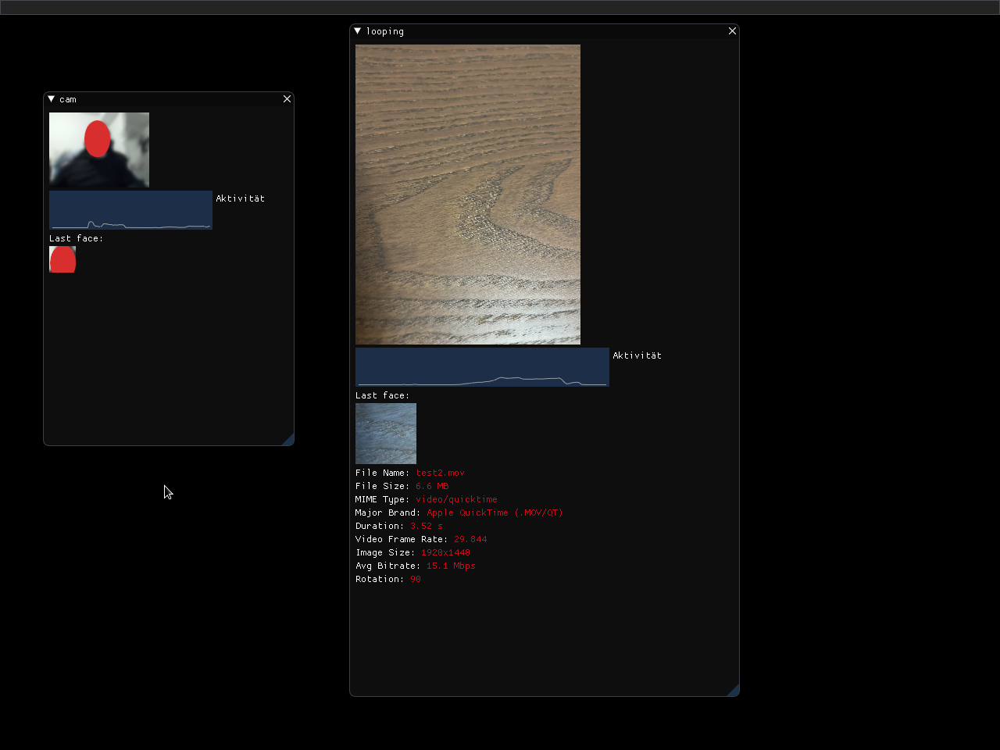

# PALLEON GUI

> This is a repository that's part of the Palleon project, which in turn is a part of the SoC 2022.
>
> This project is still very much WIP, so everything is subject to radical change as I have to
> adjust everything to new requirements that come up on the way of developing.
>
> So I am sorry for everyone who has to look at this code. It will get better - I hope...

## Directory structure

- **gui/** contains all sourcecode mainly responsible for the gui (e.g. creates the window etc.)
- **plugins/** contains all plugins (and with them some gui and data code)

## Creating a plugin
The easiest way to create a plugin is to copy the example_element plugin.
Then add the created plugin class to the plugins array in `plugins/__init__.py`.

## How it works

1. connects to the palleon core
2. wait for image and data updates (in a different thread than the gui)
3. pass them on to the plugins
4. the plugins draw method is called such that they can show whatever they want
5. go to step 2

## Installation

1. install python 3 (I am using version 3.10, I have not tested prior version)
2. install requirements from requirements.txt
3. start core
4. python main.py

## Screenshot

The following screenshot shows the default MVP configuration

